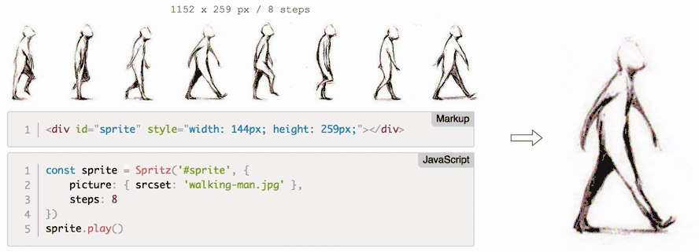

# Spritz.js

📽Modern and delightful **sprites animation library** for JavaScript!

[](https://raw.githubusercontent.com/maoosi/spritz.js/master/LICENSE.md) [](https://github.com/maoosi/spritz.js) [](https://github.com/maoosi/spritz.js/issues) [](https://travis-ci.org/maoosi/spritz.js)

*Can be used for interactive animations, 360 viewers, HTML5 games, and more...*

> ✨ **Try the [**Demo samples**](http://codepen.io/collection/XQZjMx/).**



## Features

* **Lightweight** - under 3.3KB minified and gzipped.
* **Responsive** - syntax following the new HTML5 `picture` element.
* **Modern** - written in ES6 JavaScript, no jQuery required.
* **[Compatible](#browser-support)** - IE10+ support, mobile support.
* **[Chainable API](#api)** - play, pause, wait, and more...

## Getting Started

1. [Installation](#installation)
2. [Usage](#usage)
3. [Options](#options)
4. [API / Methods](#api)
5. [Events](#events)
6. [Browser Support](#browser-support)
7. [Contribute](#contribute)
8. [Projects using it!](#projects-using-it)
9. [License](#license)

## Installation

### Using Yarn

```bash
yarn add spritz.js
```

### Using NPM

```bash
npm i spritz.js --save
```

### Unpkg CDN

```html
<script src="https://unpkg.com/spritz.js@2.3.0/dist/spritz.js"></script>
```

## Usage

The sprite will be generated inside the HTML element passed as first parameter. The canvas dimensions will depend on the width and the height of this element.

```html
<div id="#selector"></div>
```

```javascript
// import the library
import Spritz from 'spritz.js'

// instantiate with options
const sprite = Spritz('#selector', { /* options here */ })

// 🎉 ready to control your sprite!
sprite.play().wait(2000).pause()
```

## Options

Settings overview list:

```javascript
Spritz('#selector', {
	picture: [],
	steps: 1,
	rows: 1
})
```

Full option details are detailed below.

| Option | Type | Default | Description |
| --- | --- | --- | --- |
| `picture` | *array* | `[]` | Array of picture objects to be used as Sprite. The syntax is close to the new HTML5 `picture` element. [More details below.](#picture) |
| `steps` | *integer* | `1` | Number of steps (or frames) composing the sprite. |
| `rows` | *integer* | `1` | Number of rows (or lines) composing the sprite. |
| `init` | *integer* | `1` | Initial sprite step. Set to `false` to disable the default auto‑init() feature. |

Sprite object will be displayed as per background-size .

### Picture

The picture option syntax is close to the new HTML5 `picture` element. The library will choose the most suitable source according to the current layout of the page and the browser it will be displayed into. Sense of reading is following the array order (first to last element).

**Parameters:**

| Key | Type | Description |
| --- | --- | --- |
| `srcset` | required | Accepts a single image file path (e.g. `srcset: 'kitten.png'`). WebP format accepted for compatible browsers (built-in detection). |
| `media ` | optional | Accepts any valid media query that you would normally find in a CSS @media selector (e.g. `media: '(max-width: 1200px)'`). |
| `width ` | required | Specify the full width in pixels, of the sprite source image (e.g. `width: 7800`). |
| `height ` | required | Specify the full width in pixels, of the sprite source image (e.g. `height: 2829`). |
| `objectFit` | optional | Specifies how the sprite should be fitted to the parent. Values: `contain` or `cover`. Default: `contain`. |

**Example:**

```javascript
[
	{
		srcset: 'kitten-highres.png',
		media: '(min-width: 1200px)',
		objectFit: 'cover',
		width: 7800, height: 2829
	},
	{
		srcset: 'kitten.webp',
		width: 3900, height: 1415
	},
	{
		srcset: 'kitten.png',
		width: 3900, height: 1415
	}
]
```

## API

Spritz exposes the following chainable API methods.

### Basic methods

* [fps](#fps)
* [play](#play)
* [playback](#playback)
* [pause](#pause)
* [stop](#stop)
* [wait](#wait)
* [step](#step)
* [next](#next)
* [prev](#prev)

### Advanced methods

* [init](#init)
* [destroy](#destroy)
* [until](#until)
* [flip](#flip)
* [get](#get)

#### .fps()

Change animation speed from its default value (15).

```javascript
sprite.fps(10) // Change speed to 10fps
```

#### .play()

Play animation forward (using the current fps value). A `backward` option can be passed as parameter.

```javascript
sprite.play()
sprite.play('backward') // Alternative way to play an animation backward
```

#### .playback()

Play animation backward (using the current fps value).

```javascript
sprite.playback()
```

#### .pause()

Pause the current animation.

```javascript
sprite.pause()
```

#### .stop()

Stop the current animation (pause and reset to the initial step).

```javascript
sprite.stop()
```

#### .wait()

Chainable timeout that can be used to delay stuff. The delay value is to be passed as parameter, in milliseconds.

```javascript
sprite.wait(1000) // Wait for 1 second

/* Usage example */
sprite
	.play() // Play animation
	.wait(2000) // Then wait for 2 second
	.stop() // Then stop animation
```

#### .step()

Change the current step (or frame) of the sprite. Target step to be passed as parameter.

```javascript
sprite.step(5) // Change current step/frame to 5
```

#### .next()

Go to the next step (or frame).

```javascript
sprite.next()
```

#### .prev()

Go to the previous step (or frame).

```javascript
sprite.prev()
```

#### .init()

Build and load the sprite, within its selector. Initial step can be passed as parameter.

```javascript
sprite.init() // Basic usage
sprite.init(2) // Initial step is 2 (default = 1)
```

#### .destroy()

Completely destroy the sprite element and behaviors. Restore the initial state.

```javascript
sprite.destroy()
```

#### .until()

The next animation will automatically pause at the value specified. Two parameters can be used:

- step (required): Step/frame at which the animation should stop.
- loop (optional, default 1): Loop at which the animation should stop.

```javascript
sprite.until(7) // Animation will automatically stop at step/frame 7
sprite.until(3, 2) // Animation will automatically stop at step/frame 3, on the second loop

/* Usage example */
sprite
	.until(7) // Stop following animation at step/frame 7
	.play() // Play animation (will automatically stop at step/frame 7)
```

#### .flip()

Flip the sprite horizontally.

```javascript
sprite.flip()
```

#### .get()

Return data, then call the callback function with result. Two parameters can be used:

- data (required): Data to return. Possible values: `step`| `picture`.
- callback (optional): Callback function to be called with result as first parameter.

```javascript
// console log the current step/frame
sprite.get('step', (currentStep) => {
	console.log(currentStep)
})

// console log the current picture in use
sprite.get('picture', (pic) => {
	console.log(pic)
})
```

> Note that this method, like the others, is chainable.

## Events

The following events can be used to write custom callbacks functions.

```javascript
// Sprite is ready for use (after init)
sprite.on('ready', () => { /* Your code here */ })

// Sprite image has been loaded (current 'picture' loaded passed as parameter)
sprite.on('load', (picture) => { /* Your code here */ })

// Sprite has been destroyed
sprite.on('destroy', () => { /* Your code here */ })

// Sprite animation start ('forward' or 'backward' passed as first parameter)
sprite.on('play', (direction) => { /* Your code here */ })

// Sprite animation pause
sprite.on('pause', () => { /* Your code here */ })

// Sprite animation stop
sprite.on('stop', () => { /* Your code here */ })

// Animation timeout delay in  progress ('delay' value passed as parameter)
sprite.on('wait', (delay) => { /* Your code here */ })

// Step changed manually ('from' and 'to' passed as parameters)
sprite.on('change', (from, to) => { /* Your code here */ })

// Viewport has been resized (new current 'picture' passed as parameter)
sprite.on('resize', (picture) => { /* Your code here */ })
```

## Browser Support

Fully supported by Evergreen Browsers (Edge, Opera, Safari, Firefox & Chrome) and IE 10+ browsers.

> For **older browsers support like IE8 or IE9**, you'll need to manually include the following Polyfill library on your website:
>
```html
<script src="https://cdn.polyfill.io/v2/polyfill.min.js"></script>
```

## Contribute

```bash
yarn run watch
yarn run test
```

## License

[MIT](https://github.com/maoosi/spritz.js/blob/master/LICENSE.md) © 2017-2019 Sylvain Simao

[](http://forthebadge.com)
